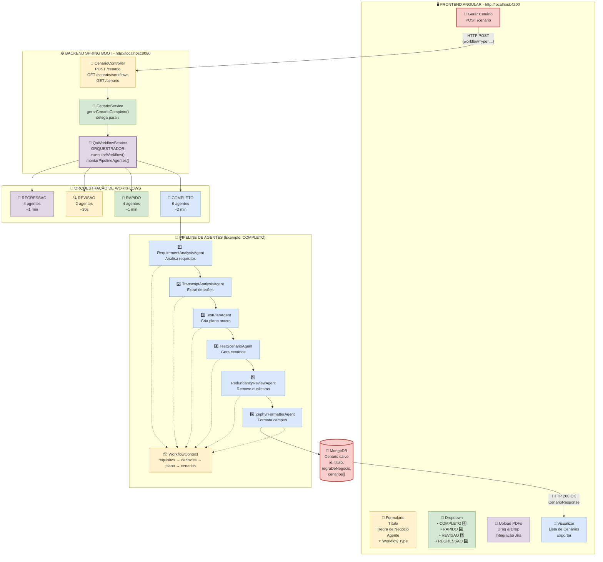

## 📊 **Como usar este diagrama:**

### **Opção 1: Visualizar online** ⭐
1. Copie todo o código acima (incluindo ```mermaid)
2. Acesse: https://mermaid.live/
3. Cole o código
4. Visualize o diagrama interativo
5. Exporte como PNG/SVG/PDF

### **Opção 2: GitHub/GitLab**
- Este código Mermaid é renderizado automaticamente no GitHub/GitLab
- Basta criar um README.md com este conteúdo

### **Opção 3: VS Code**
1. Instale extensão "Markdown Preview Mermaid Support"
2. Abra este arquivo
3. Pressione Ctrl+Shift+V (preview)

### **Opção 4: Converter para Draw.io**
1. Acesse: https://mermaid.live/
2. Cole o código acima
3. Clique em "Actions" → "Export as SVG"
4. Abra draw.io → File → Import → SVG
