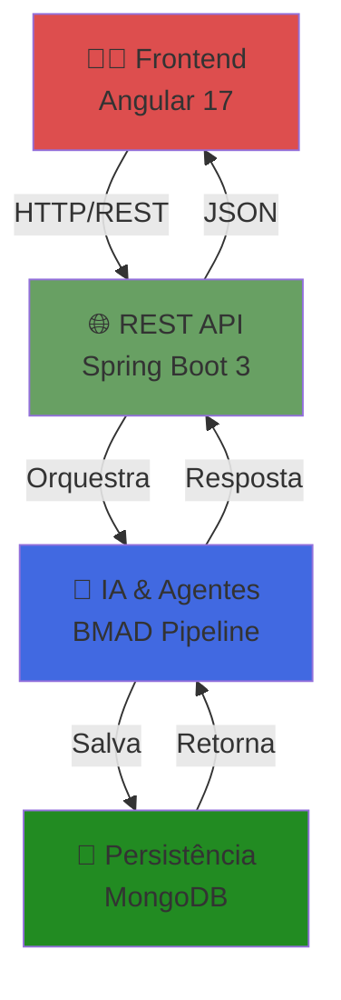
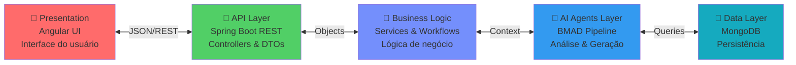
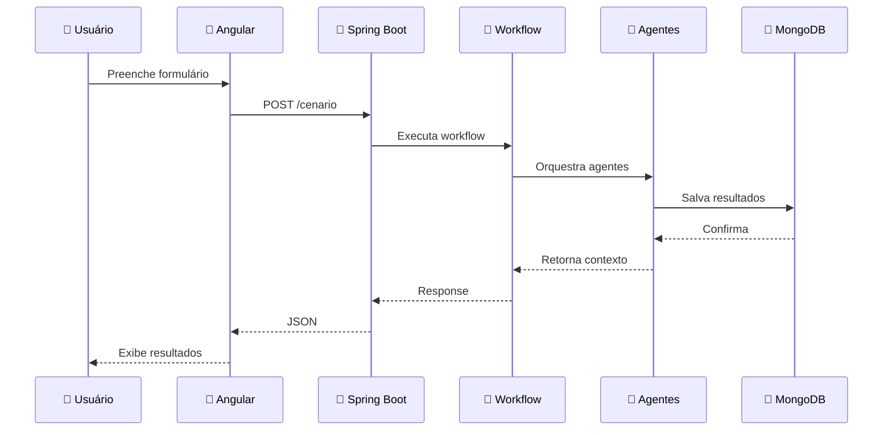
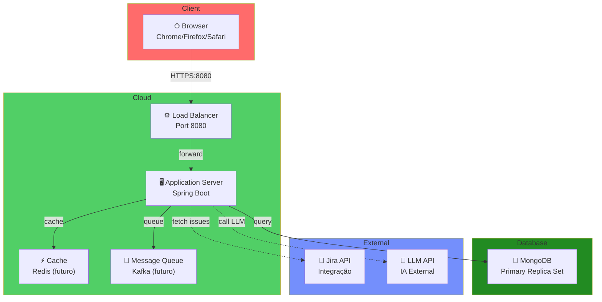

# 🏛️ 01 - Arquitetura Geral

**Para quem:** Executivos, PMs, qualquer pessoa que quer entender o projeto em 30 segundos.

**Tempo de leitura:** 2 minutos

---

## Stack Tecnológico

---

## Camadas da Aplicação

---

## Componentes Principais

| Componente | Tecnologia | Responsabilidade |
|-----------|-----------|-----------------|
| **Frontend** | Angular 17 | Interface gráfica, formulários, visualização de resultados |
| **Backend API** | Spring Boot 3 | REST API, validação, orquestração |
| **Workflow Engine** | Java Service | Orquestra múltiplos agentes em sequência |
| **IA Agents** | BMAD Pipeline | Análise de requisitos, transcrição, planos, cenários |
| **Banco de Dados** | MongoDB | Persistência de cenários, resultados, histórico |
| **Message Queue** | Kafka *(futuro)* | Assincronismo e escalabilidade |

---

## Fluxo de Dados - 30 Segundos

---

## Infraestrutura

---

## Padrões Arquiteturais

### 1. **MVC Pattern** (Frontend)
- **Model:** Estado Angular (RxJS)
- **View:** Componentes HTML/CSS
- **Controller:** Services Angular

### 2. **Layered Architecture** (Backend)
- **Presentation Layer:** Controllers
- **Business Layer:** Services
- **Data Layer:** Repositories

### 3. **Pipeline Pattern** (Agentes)
- Múltiplos agentes executam em sequência
- Cada agente recebe contexto e enriquece
- Resultado final é composto de saídas de todos os agentes

### 4. **Repository Pattern** (Dados)
- Abstração de acesso a dados
- Facilita testes e mudança de BD

---

## Características Principais

✅ **Multi-Tenant Ready** - Suporta múltiplos usuários/empresas  
✅ **Escalável** - Design preparado para crescimento  
✅ **Testável** - Separação de responsabilidades  
✅ **Resiliente** - Tratamento de erros em múltiplas camadas  
✅ **Documentado** - Código comentado e documentação externa  
✅ **CI/CD Ready** - Dockerizado, pronto para pipeline  

---

## Próximas Evoluções

🔮 **Message Queue** → Processamento assincronismo  
🔮 **Cache Layer** → Melhor performance  
🔮 **Microserviços** → Escalabilidade horizontal  
🔮 **API Gateway** → Gerenciamento de APIs  
🔮 **Observability** → Logs, métricas, tracing  

---

**[⬅️ Voltar ao Índice](README.md)** | **[Próximo → Fluxo de Execução](02-fluxo-execucao.md)**
