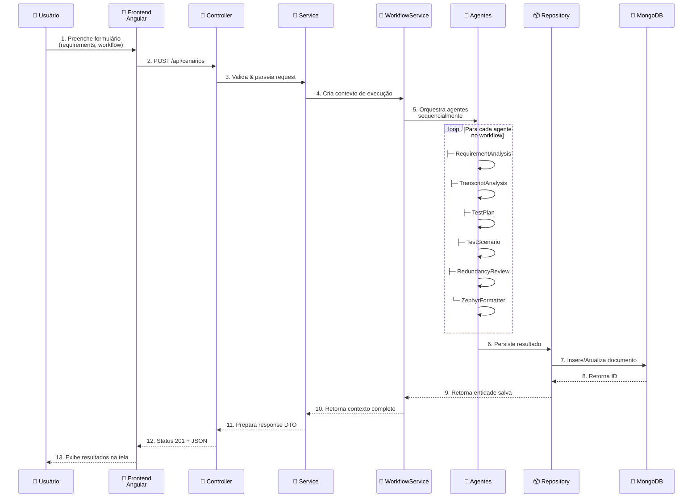
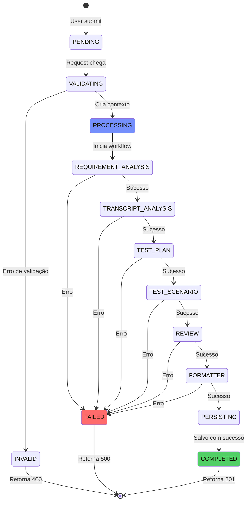
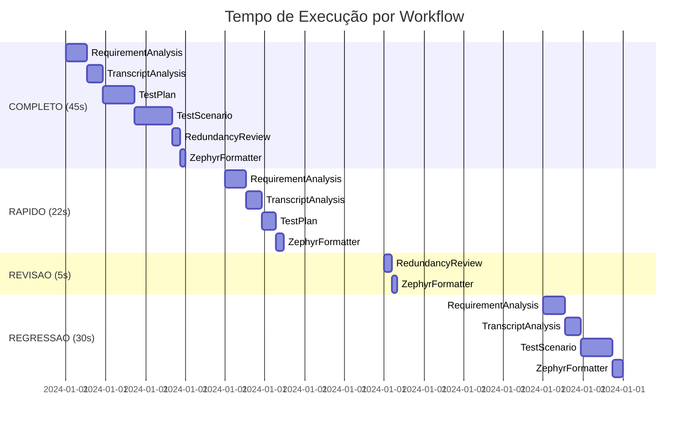
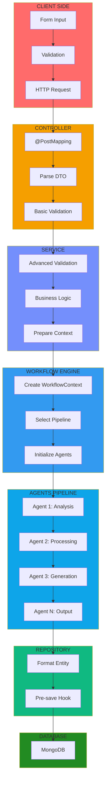
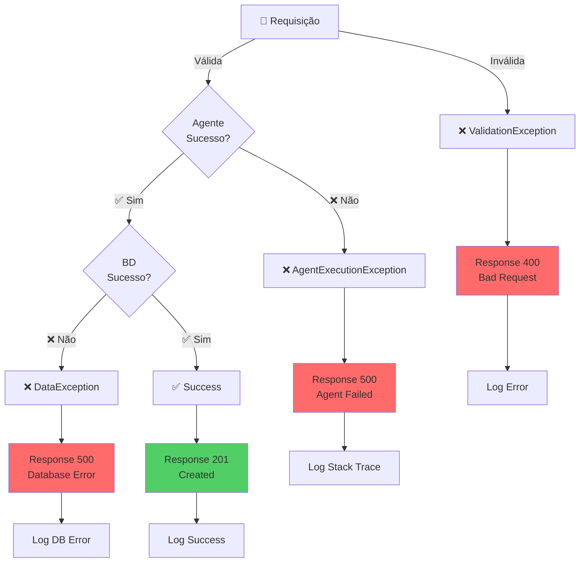
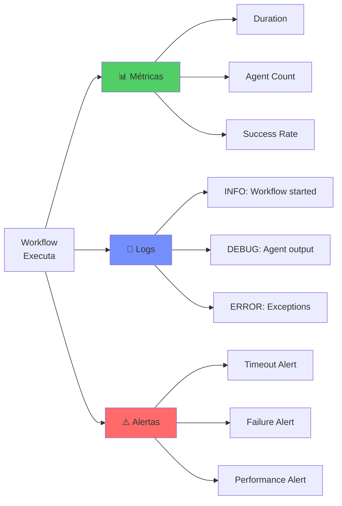

# 🔄 02 - Fluxo de Execução

**Para quem:** Desenvolvedores, QAs, qualquer um querendo entender como uma requisição é processada.

**Tempo de leitura:** 5 minutos

---

## Fluxo Passo a Passo



---

## Estados da Execução



---

## Exemplo: Workflow COMPLETO

### 1️⃣ Request

```bash
curl -X POST http://localhost:8080/api/cenarios \
  -H "Content-Type: application/json" \
  -d '{
    "requirements": "Validar login com email ou CPF",
    "transcript": "Sistema de autenticação com dois caminhos: email ou CPF",
    "workflowType": "COMPLETO"
  }'
```

### 2️⃣ Response

```json
{
  "id": "67890abc...",
  "status": "COMPLETED",
  "duration": "45s",
  "workflow": "COMPLETO",
  "agentsExecuted": [
    {
      "name": "RequirementAnalysis",
      "status": "COMPLETED",
      "duration": 8,
      "output": {...}
    },
    {
      "name": "TranscriptAnalysis",
      "status": "COMPLETED",
      "duration": 6,
      "output": {...}
    },
    {
      "name": "TestPlan",
      "status": "COMPLETED",
      "duration": 12,
      "output": {...}
    },
    {
      "name": "TestScenario",
      "status": "COMPLETED",
      "duration": 14,
      "output": {...}
    },
    {
      "name": "RedundancyReview",
      "status": "COMPLETED",
      "duration": 3,
      "output": {...}
    },
    {
      "name": "ZephyrFormatter",
      "status": "COMPLETED",
      "duration": 2,
      "output": {...}
    }
  ],
  "finalOutput": {
    "testCases": [...],
    "formattedForZephyr": {...}
  }
}
```

---

## Tempo de Execução por Workflow



---

## Fluxo de Dados por Camada



---

## Tratamento de Erros



---

## Comparação de Workflows

| Workflow | Agentes | Tempo | Uso |
|----------|---------|-------|-----|
| **COMPLETO** | 6 | ~45s | Análise completa de requisitos com revisão |
| **RAPIDO** | 4 | ~22s | Geração rápida focada em testes |
| **REVISAO** | 2 | ~5s | Revisão de testes existentes |
| **REGRESSAO** | 4 | ~30s | Testes de regressão |

---

## Monitoramento



---

## Checklist de Validação

- ✅ Requisição tem campos obrigatórios
- ✅ Workflow type é válido
- ✅ Agentes executam em sequência
- ✅ Contexto é passado entre agentes
- ✅ Resultado é persistido
- ✅ Response tem status correto
- ✅ Erros são loguados

---

**[⬅️ Voltar](01-arquitetura-geral.md)** | **[Próximo → Pipeline BMAD →](03-pipeline-bmad.md)**
