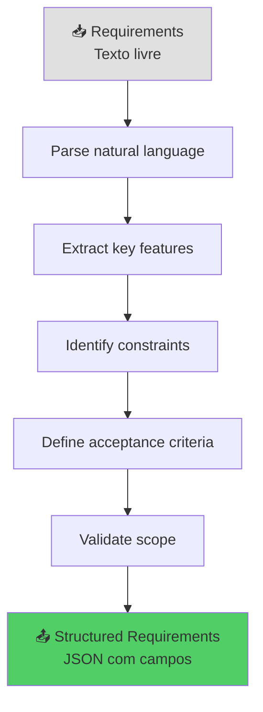
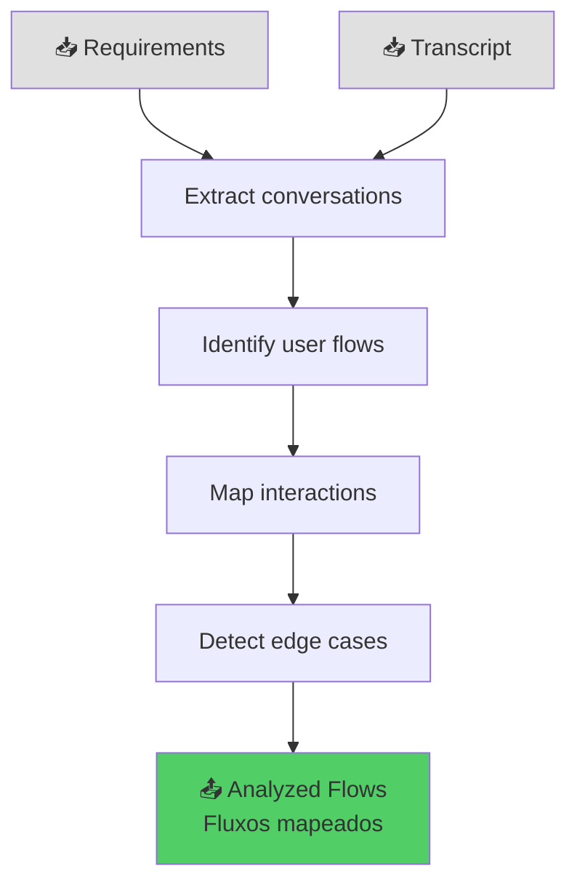
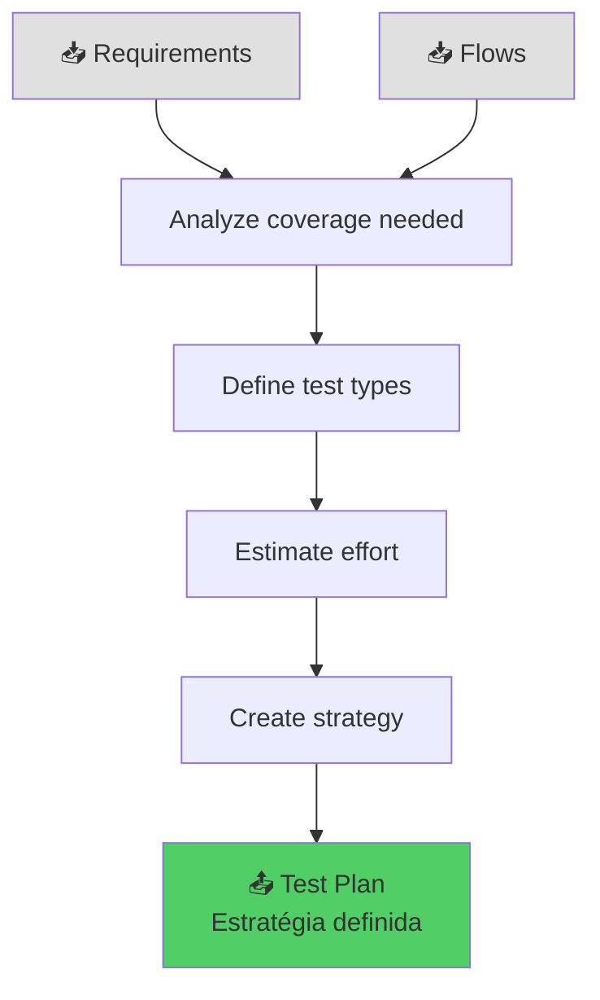
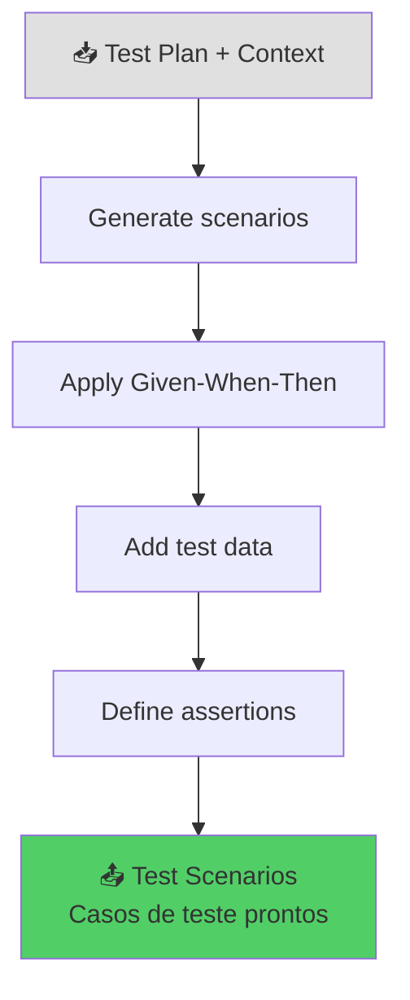
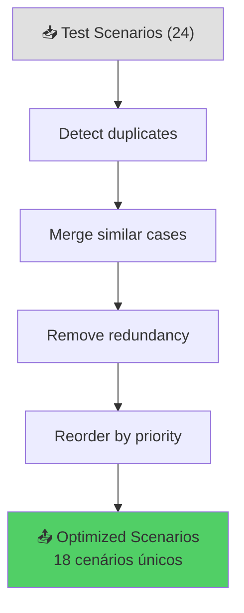
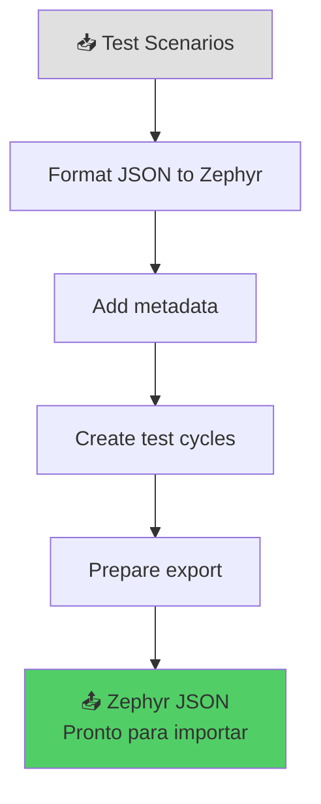
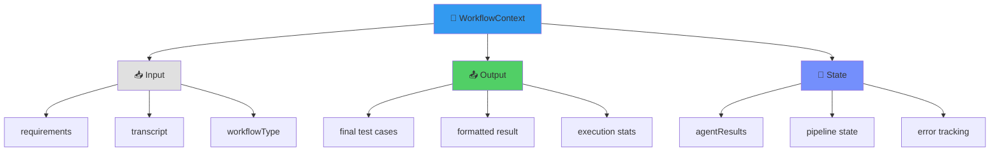
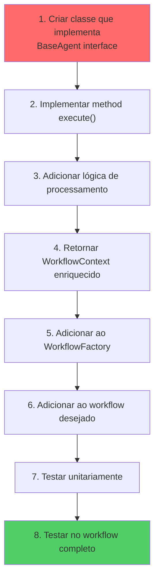

# 🤖 03 - Pipeline BMAD (Business Multi-Agent Design)

**Para quem:** Arquitetos, desenvolvedores que querem entender como os agentes funcionam.

**Tempo de leitura:** 8 minutos

---

## O que é BMAD?

**BMAD** = Business Multi-Agent Design

É um padrão arquitetural que usa múltiplos agentes especializados, cada um com uma responsabilidade clara, executados em sequência. Cada agente **enriquece** o contexto compartilhado.

---

## Pipeline Completo (6 Agentes)

```mermaid
graph LR
    Input["📥 Input<br/>(Requirements<br/>Transcript)"]
    
    RA["1️⃣ RequirementAnalysis<br/>━━━━━━━━━━━━━━━━━<br/>Analisa requisitos<br/>Extrai funcionalidades<br/>Valida escopo"]
    
    TA["2️⃣ TranscriptAnalysis<br/>━━━━━━━━━━━━━━━━━<br/>Processa transcrição<br/>Identifica fluxos<br/>Mapeia casos de uso"]
    
    TP["3️⃣ TestPlan<br/>━━━━━━━━━━━━━━━━━<br/>Cria plano de testes<br/>Define estratégia<br/>Estima cobertura"]
    
    TS["4️⃣ TestScenario<br/>━━━━━━━━━━━━━━━━━<br/>Gera cenários de teste<br/>Cria casos de teste<br/>Define dados de teste"]
    
    RR["5️⃣ RedundancyReview<br/>━━━━━━━━━━━━━━━━━<br/>Revisa redundância<br/>Otimiza testes<br/>Remove duplicatas"]
    
    ZF["6️⃣ ZephyrFormatter<br/>━━━━━━━━━━━━━━━━━<br/>Formata para Zephyr<br/>Prepara exportação<br/>Validar estrutura"]
    
    Output["📤 Output<br/>(Test Cases<br/>Formatted for Zephyr)"]
    
    Input --> RA
    RA --> TA
    TA --> TP
    TP --> TS
    TS --> RR
    RR --> ZF
    ZF --> Output
    
    style Input fill:#e0e0e0
    style Output fill:#51cf66
    style RA fill:#ff6b6b
    style TA fill:#ff8c00
    style TP fill:#ffd700
    style TS fill:#4169e1
    style RR fill:#708090
    style ZF fill:#20b2aa
```



---

## Cada Agente em Detalhes

### 1️⃣ RequirementAnalysis Agent

**Entrada:** Requirements text  
**Saída:** Structured requirements



**Exemplo:**

```
Input: "Sistema de login que aceita email ou CPF, com validação de senha forte"

Output:
{
  "features": ["Login com email", "Login com CPF", "Validação de senha"],
  "constraints": ["Senha deve ter 8+ caracteres", "Suportar 2 métodos de login"],
  "acceptanceCriteria": [
    "Usuário consegue fazer login com email válido",
    "Usuário consegue fazer login com CPF válido",
    "Sistema rejeita senhas fracas"
  ]
}
```

### 2️⃣ TranscriptAnalysis Agent

**Entrada:** Structured requirements + Transcript  
**Saída:** Analyzed flows



**Exemplo:**

```
Input: "Usuário abre app → Clica em login → Escolhe email ou CPF → Insere dados → Sistema valida → Entra no app"

Output:
{
  "flows": [
    { "name": "Happy Path Email", "steps": [...] },
    { "name": "Happy Path CPF", "steps": [...] },
    { "name": "Invalid Email", "steps": [...] },
    { "name": "Invalid CPF", "steps": [...] },
    { "name": "Weak Password", "steps": [...] }
  ]
}
```

### 3️⃣ TestPlan Agent

**Entrada:** Requirements + Flows  
**Saída:** Test strategy



**Exemplo:**

```
Input: 5 features, 8 flows, 3 edge cases

Output:
{
  "testTypes": ["Unit", "Integration", "E2E"],
  "estimatedCases": 24,
  "coverage": "85%",
  "priority": [
    "Login email - HIGH",
    "Login CPF - HIGH",
    "Invalid inputs - MEDIUM"
  ]
}
```

### 4️⃣ TestScenario Agent

**Entrada:** Test plan + All previous context  
**Saída:** Test cases (GWT format)



**Exemplo:**

```
Output: Test Case #1
{
  "id": "TC_LOGIN_001",
  "title": "Login com email válido",
  "given": "Usuário na tela de login",
  "when": "Insere email válido e senha correta",
  "then": "Faz login com sucesso",
  "data": {
    "email": "user@example.com",
    "password": "SecurePass123"
  }
}
```

### 5️⃣ RedundancyReview Agent

**Entrada:** All test scenarios  
**Saída:** Optimized scenarios



**Benefícios:**
- ✅ Reduz casos de 24 → 18
- ✅ Mantém cobertura
- ✅ Facilita manutenção
- ✅ Economiza tempo de teste

### 6️⃣ ZephyrFormatter Agent

**Entrada:** Optimized test scenarios  
**Saída:** Formatted for Zephyr



---

## Workflows: Diferentes Pipelines

```mermaid
graph TB
    subgraph COMPLETO["COMPLETO (6 agentes)"]
        C1["RA"] --> C2["TA"] --> C3["TP"] --> C4["TS"] --> C5["RR"] --> C6["ZF"]
    end
    
    subgraph RAPIDO["RAPIDO (4 agentes)"]
        R1["RA"] --> R2["TA"] --> R3["TP"] --> R4["ZF"]
    end
    
    subgraph REVISAO["REVISAO (2 agentes)"]
        RV1["RR"] --> RV2["ZF"]
    end
    
    subgraph REGRESSAO["REGRESSAO (4 agentes)"]
        REG1["RA"] --> REG2["TA"] --> REG3["TS"] --> REG4["ZF"]
    end
    
    style COMPLETO fill:#ff6b6b
    style RAPIDO fill:#f59f00
    style REVISAO fill:#748ffc
    style REGRESSAO fill:#0ea5e9
```



---

## WorkflowContext: O Coração do Pipeline



**WorkflowContext é imutável e passa por toda a pipeline**, cada agente:
1. **Recebe** contexto imutável
2. **Processa** seus dados
3. **Retorna** novo contexto com seus resultados adicionados

```java
// Fluxo de contexto
WorkflowContext ctx1 = new WorkflowContext(input);
WorkflowContext ctx2 = requirementAgent.execute(ctx1);     // Agrega RA output
WorkflowContext ctx3 = transcriptAgent.execute(ctx2);      // Agrega TA output
WorkflowContext ctx4 = testPlanAgent.execute(ctx3);        // Agrega TP output
WorkflowContext ctx5 = testScenarioAgent.execute(ctx4);    // Agrega TS output
WorkflowContext ctx6 = redundancyAgent.execute(ctx5);      // Agrega RR output
WorkflowContext ctx7 = formatterAgent.execute(ctx6);       // Agrega ZF output
// ctx7 agora contém output de todos os agentes
```

---

## Vantagens da Arquitetura BMAD

| Vantagem | Descrição |
|----------|-----------|
| **Separação de Responsabilidades** | Cada agente tem uma função clara |
| **Testabilidade** | Cada agente pode ser testado independentemente |
| **Reutilização** | Agentes podem ser usados em diferentes workflows |
| **Escalabilidade** | Fácil adicionar novos agentes |
| **Manutenibilidade** | Código organizado e facil de entender |
| **Rastreabilidade** | Saber exatamente qual agente fez cada coisa |

---

## Adicionando um Novo Agente



---

## Comparação com Outras Arquiteturas

| Aspecto | BMAD | Microservices | Monolith |
|--------|------|---------------|----------|
| **Modularidade** | ⭐⭐⭐⭐⭐ | ⭐⭐⭐⭐⭐ | ⭐⭐ |
| **Complexidade** | ⭐⭐⭐ | ⭐⭐⭐⭐⭐ | ⭐ |
| **Performance** | ⭐⭐⭐⭐ | ⭐⭐⭐ | ⭐⭐⭐⭐⭐ |
| **Testabilidade** | ⭐⭐⭐⭐⭐ | ⭐⭐⭐⭐ | ⭐⭐ |
| **Escalabilidade** | ⭐⭐⭐⭐ | ⭐⭐⭐⭐⭐ | ⭐⭐ |

---

**[⬅️ Voltar](02-fluxo-execucao.md)** | **[Próximo → Diagrama de Classes →](04-diagrama-classes.md)**
