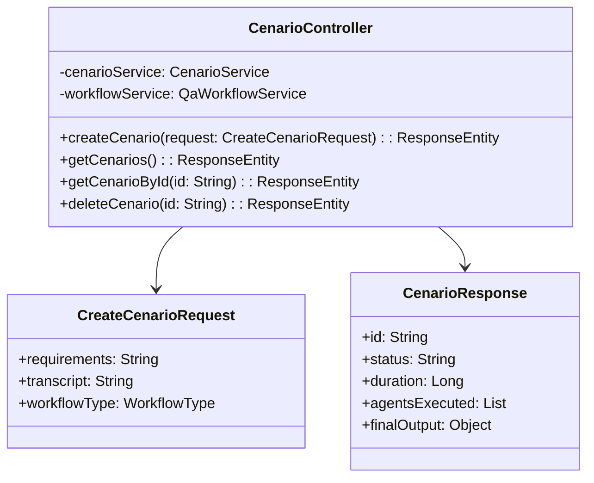
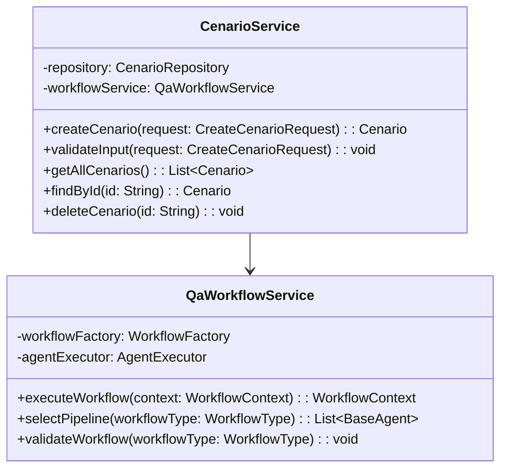
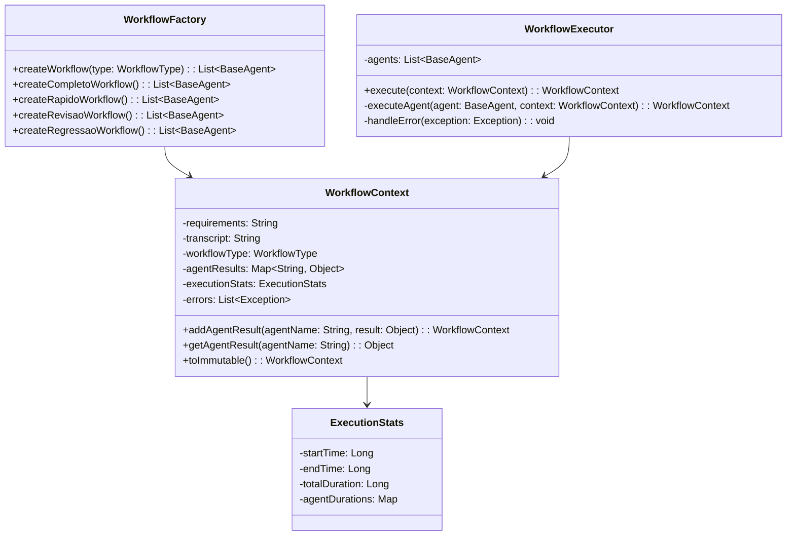
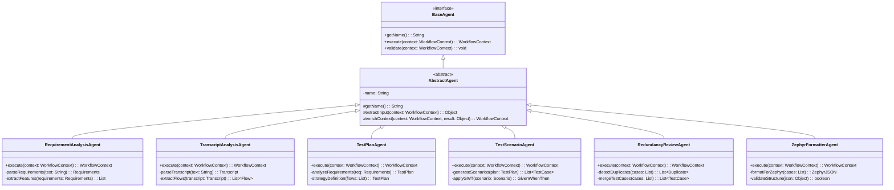
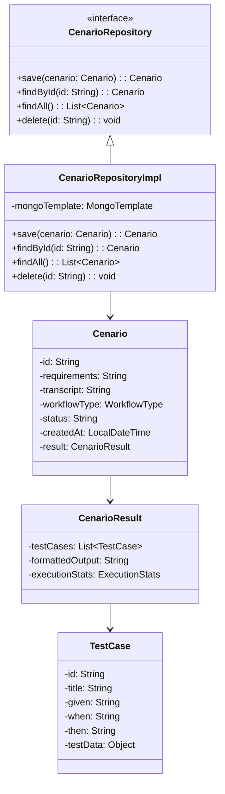
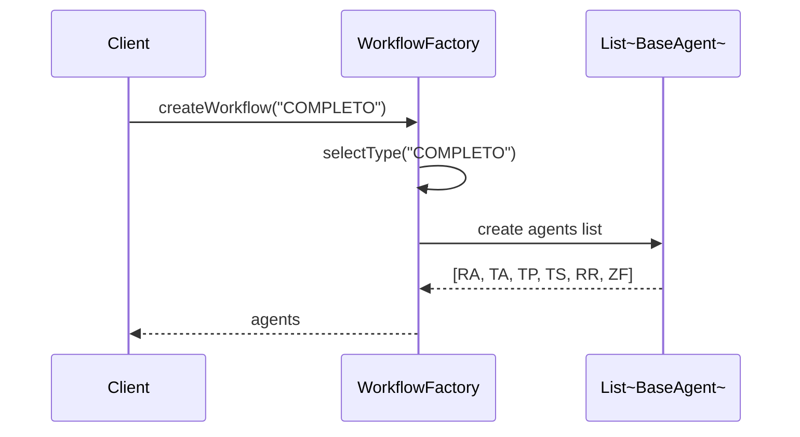
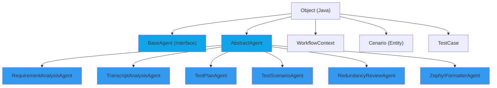
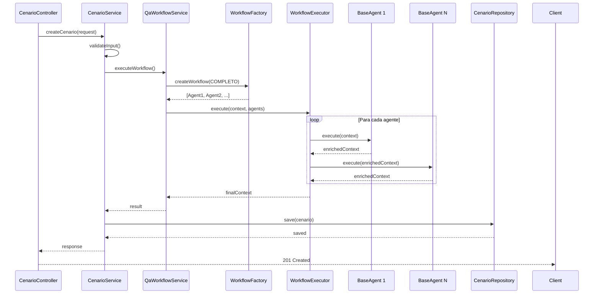
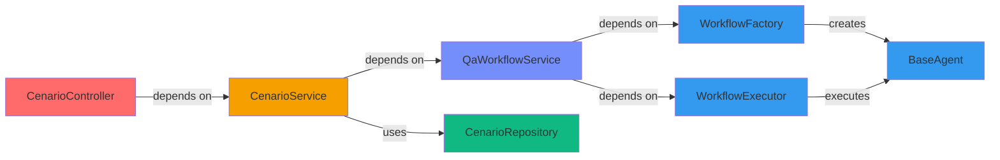

# 📦 04 - Diagrama de Classes (UML Simplificado)

**Para quem:** Desenvolvedores, arquitetos que precisam entender a estrutura de classes.

**Tempo de leitura:** 10 minutos

---

## Estrutura Geral

```mermaid
graph TB
    subgraph CONTROLLER["CONTROLLER LAYER"]
        CECON["CenarioController<br/>━━━━━━━━━━━━━<br/>+ POST /cenarios<br/>+ GET /cenarios"]
    end
    
    subgraph SERVICE["SERVICE LAYER"]
        CESVC["CenarioService<br/>━━━━━━━━━━━━━<br/>+ createCenario()<br/>+ validateInput()"]
        
        QASVC["QaWorkflowService<br/>━━━━━━━━━━━━━<br/>+ executeWorkflow()<br/>+ selectPipeline()"]
    end
    
    subgraph WORKFLOW["WORKFLOW ENGINE"]
        WF["WorkflowFactory<br/>━━━━━━━━━━━━━<br/>+ createWorkflow()"]
        
        WFX["WorkflowExecutor<br/>━━━━━━━━━━━━━<br/>+ execute()"]
        
        CTX["WorkflowContext<br/>━━━━━━━━━━━━━<br/>+ requirements<br/>+ transcript<br/>+ agentResults"]
    end
    
    subgraph AGENTS["AGENTS LAYER"]
        BA["«interface»<br/>BaseAgent<br/>━━━━━━━━━━━━━<br/>+ execute()"]
        
        RA["RequirementAnalysisAgent<br/>━━━━━━━━━━━━━<br/>+ execute()"]
        
        TA["TranscriptAnalysisAgent<br/>━━━━━━━━━━━━━<br/>+ execute()"]
        
        TP["TestPlanAgent<br/>━━━━━━━━━━━━━<br/>+ execute()"]
        
        TS["TestScenarioAgent<br/>━━━━━━━━━━━━━<br/>+ execute()"]
        
        RR["RedundancyReviewAgent<br/>━━━━━━━━━━━━━<br/>+ execute()"]
        
        ZF["ZephyrFormatterAgent<br/>━━━━━━━━━━━━━<br/>+ execute()"]
    end
    
    subgraph REPOSITORY["REPOSITORY LAYER"]
        CERES["CenarioRepository<br/>━━━━━━━━━━━━━<br/>+ save()<br/>+ findById()"]
    end
    
    CECON --> CESVC
    CESVC --> QASVC
    QASVC --> WF
    WF --> WFX
    WFX --> CTX
    WFX --> BA
    BA <|-- RA
    BA <|-- TA
    BA <|-- TP
    BA <|-- TS
    BA <|-- RR
    BA <|-- ZF
    WFX --> CERES
    
    style CONTROLLER fill:#ff6b6b
    style SERVICE fill:#f59f00
    style WORKFLOW fill:#748ffc
    style AGENTS fill:#339af0
    style REPOSITORY fill:#10b981
```

---

## Classes Detalhadas

### Controller Layer



### Service Layer



### Workflow Engine



### Agents Layer



### Data Layer



---

## Padrões Usados

### 1. Factory Pattern (WorkflowFactory)



### 2. Strategy Pattern (Workflows)

```
Cada workflow é uma "strategy" diferente:
- COMPLETO: Full analysis (6 agents)
- RAPIDO: Quick analysis (4 agents)
- REVISAO: Review only (2 agents)
- REGRESSAO: Regression focus (4 agents)
```

### 3. Template Method (BaseAgent)

```java
// Padrão em BaseAgent e AbstractAgent
abstract class AbstractAgent implements BaseAgent {
    final WorkflowContext execute(WorkflowContext ctx) {
        Object input = extractInput(ctx);        // Template method
        Object result = doExecute(input);        // Implementado por subclasses
        return enrichContext(ctx, result);       // Template method
    }
    
    abstract Object doExecute(Object input);
}
```

### 4. Immutable Value Object (WorkflowContext)

```
WorkflowContext é imutável:
- Cada operação retorna uma nova instância
- Preserva histórico de execução
- Thread-safe naturalmente
```

---

## Hierarquia de Classe



---

## Fluxo de Execução com Detalhes de Classe



---

## Dependências Entre Componentes



---

## Checklist de Implementação de Novo Agente

- [ ] Criar classe que estende `AbstractAgent`
- [ ] Implementar método `doExecute()`
- [ ] Implementar validação no `validate()`
- [ ] Adicionar testes unitários
- [ ] Registrar no `WorkflowFactory`
- [ ] Adicionar ao workflow desejado
- [ ] Testar integração
- [ ] Documentar comportamento

---

**[⬅️ Voltar](03-pipeline-bmad.md)** | **[Próximo → Sequência de Requisição →](05-sequencia-requisicao.md)**
