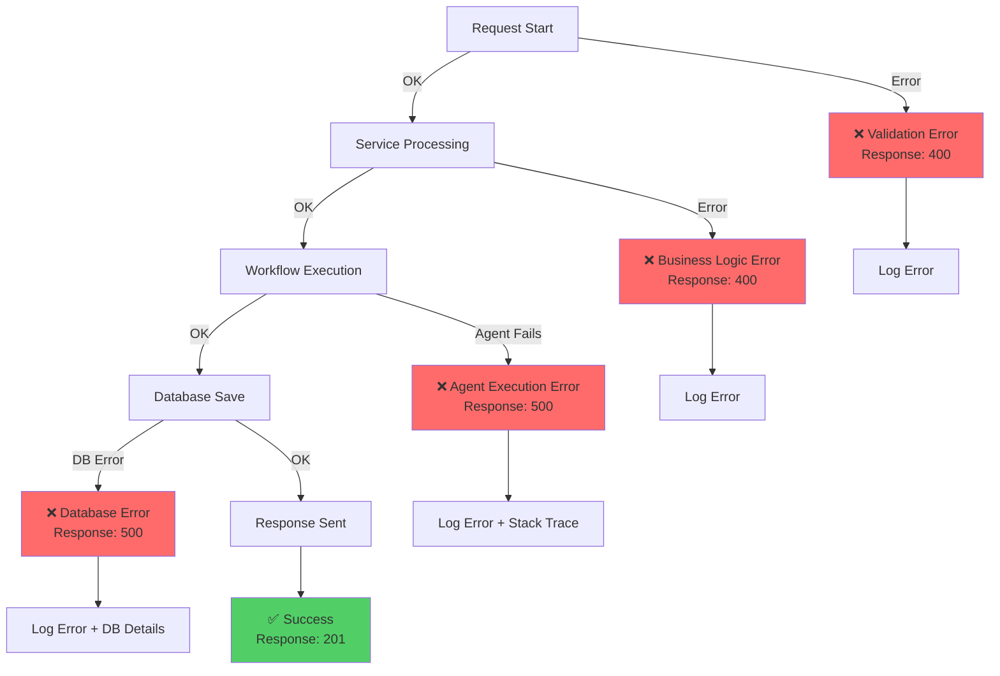

# ↔️ 05 - Sequência da Requisição (Request to Response)

**Para quem:** Debuggers, alguém que quer traçar exatamente o que acontece com uma requisição.

**Tempo de leitura:** 6 minutos

---

## Caminho Completo de uma Requisição

```mermaid
sequenceDiagram
    participant Browser as 🌐 Browser
    participant Angular as 🎨 Angular<br/>Frontend
    participant Network as 📡 HTTP<br/>Network
    participant Controller as 🎯 Controller
    participant Service as 💼 Service
    participant Workflow as 🔄 Workflow<br/>Service
    participant Factory as 🏭 Factory
    participant Executor as ⚙️ Executor
    
    Browser->>Angular: 1. User submits form
    activate Angular
    Angular->>Angular: 2. Validate form fields
    Angular->>Angular: 3. Prepare DTO
    
    rect rgb(200, 200, 255)
        note right of Angular: Preparation
        Angular->>Angular: CenarioRequest {<br/>  requirements: "...",<br/>  transcript: "...",<br/>  workflowType: "COMPLETO"<br/>}
    end
    
    Angular->>Network: 4. POST /api/cenarios<br/>Content-Type: application/json
    deactivate Angular
    
    activate Network
    Network->>Controller: 5. HTTP Request arrives
    deactivate Network
    
    activate Controller
    Controller->>Controller: 6. @PostMapping handler
    Controller->>Controller: 7. Map JSON to DTO
    
    rect rgb(200, 200, 255)
        note right of Controller: Deserialization
        Controller->>Controller: RequestDeserializer<br/>JSON → CreateCenarioRequest
    end
    
    Controller->>Service: 8. cenarioService.createCenario(request)
    deactivate Controller
    
    activate Service
    Service->>Service: 9. Validate input<br/>- Check required fields<br/>- Validate workflow type
    
    rect rgb(200, 200, 255)
        note right of Service: Validation
        Service->>Service: Constraints checked:<br/>- requirements not null<br/>- workflow type is valid
    end
    
    Service->>Workflow: 10. qawWorkflowService.executeWorkflow()
    deactivate Service
    
    activate Workflow
    Workflow->>Factory: 11. workflowFactory.createWorkflow(COMPLETO)
    deactivate Workflow
    
    activate Factory
    Factory->>Factory: 12. Select pipeline<br/>case COMPLETO:<br/>  return [RA, TA, TP,<br/>    TS, RR, ZF]
    
    rect rgb(200, 200, 255)
        note right of Factory: Pipeline Selection
        Factory->>Factory: new RequirementAnalysisAgent()<br/>new TranscriptAnalysisAgent()<br/>new TestPlanAgent()<br/>new TestScenarioAgent()<br/>new RedundancyReviewAgent()<br/>new ZephyrFormatterAgent()
    end
    
    Factory-->>Workflow: 13. agents list
    deactivate Factory
    
    activate Workflow
    Workflow->>Executor: 14. workflowExecutor.execute(context, agents)
    deactivate Workflow
    
    activate Executor
    Executor->>Executor: 15. Create WorkflowContext<br/>with input data
    
    rect rgb(200, 255, 200)
        note right of Executor: Pipeline Execution
        Executor->>Executor: 16a. RA.execute(ctx1)
        Executor->>Executor: 16b. ctx2 = enrich(ctx1, raOutput)
        Executor->>Executor: 16c. TA.execute(ctx2)
        Executor->>Executor: 16d. ctx3 = enrich(ctx2, taOutput)
        Executor->>Executor: ... continue for each agent
        Executor->>Executor: 16f. ZF.execute(ctx6)
        Executor->>Executor: 16g. ctx7 = enrich(ctx6, zfOutput)
    end
    deactivate Executor
    
    activate Executor
    Executor-->>Workflow: 17. Retorna ctx7<br/>(fully enriched)
    deactivate Executor
    
    activate Workflow
    Workflow-->>Service: 18. Retorna result
    deactivate Workflow
    
    activate Service
    Service->>Service: 19. Create Cenario entity<br/>from result
    
    rect rgb(200, 200, 255)
        note right of Service: Entity Creation
        Service->>Service: new Cenario() {<br/>  id: UUID,<br/>  requirements: ...,<br/>  transcript: ...,<br/>  result: {<br/>    testCases: [...],<br/>    zephyrFormatted: {...}<br/>  },<br/>  createdAt: now,<br/>  status: "COMPLETED"<br/>}
    end
    
    Service->>Service: 20. cenarioRepository.save(entity)
    
    rect rgb(200, 255, 200)
        note right of Service: Database Persistence
        Service->>Service: MongoDB connection
        Service->>Service: Insert document
        Service->>Service: Await confirmation
    end
    
    Service->>Service: 21. Prepare response DTO
    
    rect rgb(200, 200, 255)
        note right of Service: Response DTO
        Service->>Service: CenarioResponse {<br/>  id: "...",<br/>  status: "COMPLETED",<br/>  duration: 45,<br/>  agentsExecuted: [{...}],<br/>  finalOutput: {...}<br/>}
    end
    
    Service-->>Controller: 22. Retorna response
    deactivate Service
    
    activate Controller
    Controller->>Controller: 23. ResponseEntity.status(201)<br/>.body(response)
    
    rect rgb(200, 255, 200)
        note right of Controller: Response
        Controller->>Controller: HTTP Status: 201 Created<br/>Content-Type: application/json<br/>Body: CenarioResponse JSON
    end
    
    Controller->>Network: 24. HTTP Response
    deactivate Controller
    
    activate Network
    Network->>Angular: 25. Resposta chega
    deactivate Network
    
    activate Angular
    Angular->>Angular: 26. Deserialize response
    Angular->>Angular: 27. Update component state
    Angular->>Angular: 28. Trigger change detection
    Angular->>Browser: 29. Atualizar UI<br/>- Show results<br/>- Hide loading spinner<br/>- Display test cases
    deactivate Angular
    
    Browser->>Browser: 30. User sees results
```



---

## Dados em Cada Estágio

### Stage 1: Frontend Preparation

```json
{
  "stage": "Frontend Preparation",
  "data": {
    "requirements": "Validar login com email ou CPF",
    "transcript": "Sistema de autenticação...",
    "workflowType": "COMPLETO"
  },
  "timestamp": "2024-01-15T10:30:45Z"
}
```

### Stage 2: API Processing

```json
{
  "stage": "API Processing",
  "request": {
    "requirements": "Validar login com email ou CPF",
    "transcript": "Sistema de autenticação...",
    "workflowType": "COMPLETO"
  },
  "validation": "PASSED",
  "timestamp": "2024-01-15T10:30:46Z"
}
```

### Stage 3: Workflow Context Creation

```json
{
  "stage": "Workflow Context",
  "context": {
    "id": "ctx-123456",
    "input": {
      "requirements": "...",
      "transcript": "..."
    },
    "agentResults": {},
    "executionStart": "2024-01-15T10:30:46Z",
    "pipeline": ["RA", "TA", "TP", "TS", "RR", "ZF"]
  }
}
```

### Stage 4: After RequirementAnalysis

```json
{
  "stage": "After RequirementAnalysis",
  "context": {
    "input": {...},
    "agentResults": {
      "RequirementAnalysis": {
        "features": ["Login with email", "Login with CPF"],
        "constraints": ["Strong password required"],
        "acceptanceCriteria": [...]
      }
    }
  }
}
```

### Stage 5: After TestScenario (fully enriched)

```json
{
  "stage": "After TestScenario",
  "context": {
    "input": {...},
    "agentResults": {
      "RequirementAnalysis": {...},
      "TranscriptAnalysis": {...},
      "TestPlan": {...},
      "TestScenario": {
        "testCases": [
          {
            "id": "TC_001",
            "title": "Login com email válido",
            "given": "Usuário na tela de login",
            "when": "Insere email e senha",
            "then": "Faz login com sucesso"
          }
        ]
      }
    }
  }
}
```

### Stage 6: Final Response

```json
{
  "id": "67890abc-def0-1234-5678-9abcdef01234",
  "status": "COMPLETED",
  "duration": 45000,
  "workflow": "COMPLETO",
  "createdAt": "2024-01-15T10:30:46Z",
  "agentsExecuted": [
    {
      "name": "RequirementAnalysis",
      "status": "COMPLETED",
      "duration": 8000
    },
    {
      "name": "TranscriptAnalysis",
      "status": "COMPLETED",
      "duration": 6000
    },
    {
      "name": "TestPlan",
      "status": "COMPLETED",
      "duration": 12000
    },
    {
      "name": "TestScenario",
      "status": "COMPLETED",
      "duration": 14000
    },
    {
      "name": "RedundancyReview",
      "status": "COMPLETED",
      "duration": 3000
    },
    {
      "name": "ZephyrFormatter",
      "status": "COMPLETED",
      "duration": 2000
    }
  ],
  "finalOutput": {
    "testCases": [...],
    "formattedForZephyr": {...}
  }
}
```

---

## Timeline de Execução

```mermaid
gantt
    title Timeline de Requisição
    dateFormat YYYY-MM-DD HH:mm:ss
    
    section Frontend
    Validation :f1, 2024-01-01 00:00:00, 1s
    HTTP Call :f2, after f1, 1s
    
    section Controller
    Receive Request :c1, 2024-01-01 00:00:02, 0.1s
    Deserialize :c2, after c1, 0.2s
    Delegate to Service :c3, after c2, 0.1s
    
    section Service
    Validate Input :s1, 2024-01-01 00:00:02.4s, 0.5s
    Call Workflow :s2, after s1, 0.1s
    
    section Workflow
    Execute Pipeline :w1, 2024-01-01 00:00:03s, 45s
    
    section Database
    Save Result :d1, after w1, 0.5s
    
    section Response
    Prepare DTO :r1, after d1, 0.2s
    Send Response :r2, after r1, 0.5s
    
    section Frontend
    Receive Response :f3, after r2, 0.5s
    Update UI :f4, after f3, 0.5s
```

---

## Pontos de Erro Possíveis



---

## Tracing a Request (Para Debug)

### 1. Frontend (Angular DevTools)

```javascript
// Network tab → Find POST /api/cenarios
// Check:
// - Request payload
// - Response status
// - Response body
// - Response time
```

### 2. Backend (Application Logs)

```
[INFO] POST /api/cenarios received
[DEBUG] Request: CreateCenarioRequest{
  requirements: "...",
  transcript: "...",
  workflowType: "COMPLETO"
}
[DEBUG] Validation: PASSED
[INFO] Executing workflow: COMPLETO
[DEBUG] Agent 1/6 started: RequirementAnalysis
[DEBUG] Agent 1/6 completed in 8ms
[DEBUG] Agent 2/6 started: TranscriptAnalysis
...
[INFO] Workflow completed in 45ms
[DEBUG] Saving to database...
[INFO] Document saved with ID: 67890abc...
[INFO] Response sent: 201 Created
```

### 3. Database (MongoDB)

```javascript
// Find and inspect the document:
db.cenario.findOne({ _id: ObjectId("67890abc...") })
// Check:
// - All fields present
// - TestCases array populated
// - Timestamps correct
```

---

## Performance Checkpoints

| Checkpoint | Target | Warning | Critical |
|-----------|--------|---------|----------|
| Validation | < 100ms | > 200ms | > 500ms |
| Service Layer | < 500ms | > 1s | > 2s |
| Workflow Execution | < 50s | > 60s | > 90s |
| Database Save | < 500ms | > 1s | > 2s |
| Total Response | < 51s | > 65s | > 90s |

---

**[⬅️ Voltar](04-diagrama-classes.md)** | **[Próximo → Estrutura de Pacotes →](06-estrutura-pacotes.md)**
