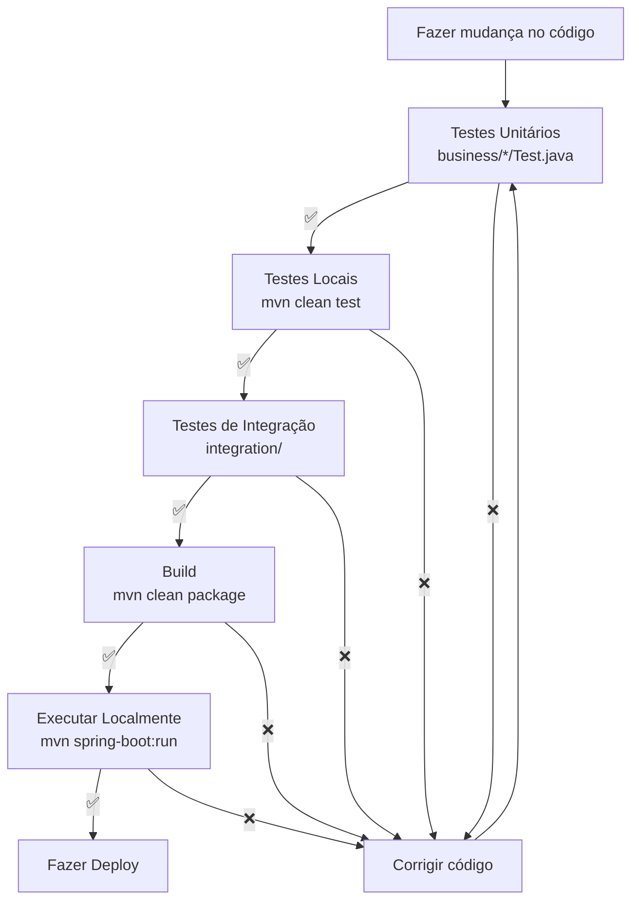

# 📂 06 - Estrutura de Pacotes (Package Structure)

**Para quem:** Desenvolvedores novatos, alguém conhecendo a estrutura do projeto.

**Tempo de leitura:** 8 minutos

---

## Visão Geral da Estrutura

```
criar-cenario-testes/
│
├── src/
│   ├── main/
│   │   ├── java/com/br/criarcenariotestes/
│   │   │   ├── controller/          📡 REST Controllers
│   │   │   ├── business/            💼 Business Logic
│   │   │   ├── parser/              🔧 Parsing/Conversion
│   │   │   └── CriarCenarioTestesApplication.java
│   │   │
│   │   └── resources/
│   │       ├── application.yml      ⚙️ Configuration
│   │       └── static/              🌐 Static files
│   │
│   └── test/
│       └── java/.../                🧪 Tests
│
├── agents/                           🤖 Agents Configuration
│   └── workflows/                    🔄 Workflow Docs
│
├── diagrams/                         📊 Architecture Diagrams
│
└── docs/                             📚 Documentation
    └── architecture/                 🏛️ Architecture Docs
```

---

## Detalhamento por Pacote

### 1. Controller Package (`com.br.criarcenariotestes.controller`)

**Responsabilidade:** Receber requisições HTTP e delegar

```
controller/
├── CenarioController.java
│   ├── @PostMapping("/cenarios")      → POST /api/cenarios
│   ├── @GetMapping("/cenarios")       → GET /api/cenarios
│   ├── @GetMapping("/cenarios/{id}")  → GET /api/cenarios/{id}
│   └── @DeleteMapping("/cenarios/{id}")
│
└── WorkflowController.java
    ├── @GetMapping("/workflows")      → GET /api/workflows
    └── @GetMapping("/workflows/{type}")
```

**Padrão:** RESTful, request/response DTOs

**Responsabilidades:**
- ✅ Receber HTTP requests
- ✅ Validar headers
- ✅ Desserializar JSON
- ✅ Delegar para services
- ✅ Serializar e retornar response

---

### 2. Business Package (`com.br.criarcenariotestes.business`)

Subdividido em camadas:

#### 2.1. Service (`business.service`)

```
business/service/
├── CenarioService.java
│   ├── createCenario()
│   ├── getAllCenarios()
│   ├── getCenarioById()
│   └── deleteCenario()
│
└── QaWorkflowService.java
    ├── executeWorkflow()
    ├── selectPipeline()
    └── validateWorkflow()
```

**Responsabilidades:**
- ✅ Aplicar lógica de negócio
- ✅ Orquestrar componentes
- ✅ Validação avançada
- ✅ Tratamento de transações

#### 2.2. Workflow (`business.workflow`)

```
business/workflow/
├── WorkflowContext.java
│   ├── requirements: String
│   ├── transcript: String
│   ├── agentResults: Map
│   └── executionStats: ExecutionStats
│
├── WorkflowFactory.java
│   ├── createWorkflow(WorkflowType)
│   ├── createCompletoWorkflow()
│   ├── createRapidoWorkflow()
│   ├── createRevisaoWorkflow()
│   └── createRegressaoWorkflow()
│
└── WorkflowExecutor.java
    ├── execute()
    └── executeAgent()
```

**Responsabilidades:**
- ✅ Orquestrar pipeline de agentes
- ✅ Gerenciar contexto compartilhado
- ✅ Selecionar workflow correto
- ✅ Executar sequência de agentes

#### 2.3. Agent (`business.agent`)

```
business/agent/
├── BaseAgent.java (Interface)
│   └── execute(WorkflowContext): WorkflowContext
│
├── AbstractAgent.java
│   ├── getName()
│   ├── extractInput()
│   └── enrichContext()
│
├── RequirementAnalysisAgent.java
├── TranscriptAnalysisAgent.java
├── TestPlanAgent.java
├── TestScenarioAgent.java
├── RedundancyReviewAgent.java
└── ZephyrFormatterAgent.java
```

**Responsabilidades:**
- ✅ Análise de requisitos
- ✅ Processamento de fluxos
- ✅ Geração de testes
- ✅ Revisão e otimização
- ✅ Formatação para exportação

#### 2.4. Fallback (`business.fallback`)

```
business/fallback/
├── CenarioFallbackFactory.java
│   ├── createFallbackCenario()
│   └── createFallbackResponse()
│
└── Fallback strategies para testes
```

**Responsabilidades:**
- ✅ Prover defaults em caso de erro
- ✅ Facilitar testes
- ✅ Graceful degradation

#### 2.5. DTO (`business.dto`)

```
business/dto/
├── CreateCenarioRequest.java
├── CenarioResponse.java
├── WorkflowInfoResponse.java
├── AgentInfoResponse.java
├── ChatMessageDto.java
├── ChatHistoryRequest.java
├── ChatHistoryResponse.java
├── JiraIssueAttachmentsResponse.java
└── JiraAttachmentResponse.java
```

**Responsabilidades:**
- ✅ Desserializar requests
- ✅ Serializar responses
- ✅ Validação de campos
- ✅ Transformação de dados

#### 2.6. Model (`business.model` - não existe, mas pode existir)

```
business/model/
├── Cenario.java
├── TestCase.java
├── ExecutionStats.java
└── WorkflowType.java (Enum)
```

**Responsabilidades:**
- ✅ Representar entidades de domínio
- ✅ Mapear para banco de dados

#### 2.7. Repository (`business.repository`)

```
business/repository/
├── CenarioRepository.java (Interface)
│   ├── save()
│   ├── findById()
│   ├── findAll()
│   └── delete()
│
└── CenarioRepositoryImpl.java
    └── (implementação com MongoTemplate)
```

**Responsabilidades:**
- ✅ Abstração de persistência
- ✅ Operações CRUD
- ✅ Queries customizadas

---

### 3. Parser Package (`com.br.criarcenariotestes.business.parser`)

```
business/parser/
├── CenarioTextoParser.java
│   ├── parse()
│   └── validate()
│
└── Outros parsers especializados
```

**Responsabilidades:**
- ✅ Converter texto para estruturas
- ✅ Validar formato
- ✅ Tratamento de erros de parsing

---

## Mapa Mental da Arquitetura

```
Request
   ↓
[Controller]
   ↓
[Service]
   ├─→ [Validation]
   ├─→ [Business Logic]
   └─→ [QaWorkflowService]
         ↓
    [WorkflowFactory]
         ↓
    [WorkflowExecutor]
         ├─→ [BaseAgent 1]
         ├─→ [BaseAgent 2]
         ├─→ [BaseAgent 3]
         └─→ [BaseAgent N]
         ↓
    [Repository]
         ↓
    [MongoDB]
   ↓
Response
```

---

## Fluxo de Dados por Pacote

```mermaid
graph TB
    subgraph IN["INPUT LAYER"]
        CT["Controller<br/>CenarioController"]
    end
    
    subgraph SVC["SERVICE LAYER"]
        CS["Service<br/>CenarioService"]
        WFS["Workflow Service<br/>QaWorkflowService"]
    end
    
    subgraph BIZ["BUSINESS LOGIC LAYER"]
        WF["Workflow<br/>Factory & Executor"]
        AG["Agents<br/>BaseAgent impl"]
    end
    
    subgraph PARSE["PROCESSING LAYER"]
        PA["Parser<br/>CenarioTextoParser"]
    end
    
    subgraph PERSIST["PERSISTENCE LAYER"]
        REP["Repository<br/>CenarioRepository"]
        DB["MongoDB"]
    end
    
    CT -->|DTO| CS
    CS -->|Validation| CS
    CS -->|executeWorkflow()| WFS
    WFS -->|createWorkflow()| WF
    WF -->|execute()| AG
    AG -->|parse| PA
    PA -->|enriched data| AG
    AG -->|final result| WFS
    WFS -->|result| CS
    CS -->|save()| REP
    REP -->|insert/update| DB
    DB -->|confirmed| REP
    REP -->|entity| CS
    CS -->|Response DTO| CT
    
    style IN fill:#ff6b6b
    style SVC fill:#f59f00
    style BIZ fill:#748ffc
    style PARSE fill:#339af0
    style PERSIST fill:#10b981
```

---

## Convenções de Pacotes

### Nomenclatura

```
✅ CORRETO:
com.br.criarcenariotestes.business.service.CenarioService
com.br.criarcenariotestes.business.agent.BaseAgent
com.br.criarcenariotestes.controller.CenarioController

❌ INCORRETO:
com.br.criarcenariotestes.Service                    (sem pacote específico)
com.br.criarcenariotestes.business.AgentFactory      (nome genérico)
com.br.criarcenariotestes.CenarioServiceImpl          (Impl no nome)
```

### Organização por Funcionalidade vs Camada

**Recomendado (Atual):** Por Camada (Controller → Service → Agent → Repository)

```
by-layer/
├── controller/
├── business/
│   ├── service/
│   ├── agent/
│   ├── workflow/
│   └── repository/
└── parser/
```

**Alternativa:** Por Funcionalidade (Feature)

```
by-feature/
├── cenario/
│   ├── controller/
│   ├── service/
│   ├── agent/
│   └── repository/
└── workflow/
    ├── controller/
    ├── service/
    └── agent/
```

---

## Arquivos de Configuração

### `application.yml`

```yaml
spring:
  application:
    name: criar-cenario-testes
  
  data:
    mongodb:
      uri: mongodb://localhost:27017
      database: cenarios_db
  
  mvc:
    cors:
      allowed-origins: "*"
      allowed-methods: "*"
```

**Localização:** `src/main/resources/application.yml`

---

## Dependências Maven

```xml
<!-- Spring Boot -->
<dependency>
  <groupId>org.springframework.boot</groupId>
  <artifactId>spring-boot-starter-web</artifactId>
</dependency>

<!-- MongoDB -->
<dependency>
  <groupId>org.springframework.boot</groupId>
  <artifactId>spring-boot-starter-data-mongodb</artifactId>
</dependency>

<!-- Testing -->
<dependency>
  <groupId>org.springframework.boot</groupId>
  <artifactId>spring-boot-starter-test</artifactId>
  <scope>test</scope>
</dependency>
```

**Arquivo:** `build.gradle`

---

## Estrutura de Testes

```
test/java/com/br/criarcenariotestes/
├── business/
│   ├── agent/
│   │   ├── RequirementAnalysisAgentTest.java
│   │   ├── TranscriptAnalysisAgentTest.java
│   │   ├── TestPlanAgentTest.java
│   │   ├── TestScenarioAgentTest.java
│   │   ├── RedundancyReviewAgentTest.java
│   │   └── ZephyrFormatterAgentTest.java
│   │
│   ├── service/
│   │   └── CenarioServiceTest.java
│   │
│   ├── workflow/
│   │   ├── WorkflowContextTest.java
│   │   └── QaWorkflowServiceTest.java
│   │
│   ├── parser/
│   │   └── CenarioTextoParserTest.java
│   │
│   └── fallback/
│       └── CenarioFallbackFactoryTest.java
│
└── integration/
    └── CenarioControllerIntegrationTest.java
```

**Padrão:** Mesmo nome da classe + `Test`

---

## Ciclo de Desenvolvimento



---

## Checklista de Novo Pacote

- [ ] Criar diretório em `business/`
- [ ] Nomeação segue convenção
- [ ] Criar interfaces (contrato)
- [ ] Criar implementações
- [ ] Criar testes unitários
- [ ] Adicionar ao Spring Context
- [ ] Documentar responsabilidades
- [ ] Adicionar exemplos de uso

---

**[⬅️ Voltar](05-sequencia-requisicao.md)** | **[📑 Índice de Arquitetura](README.md)**
